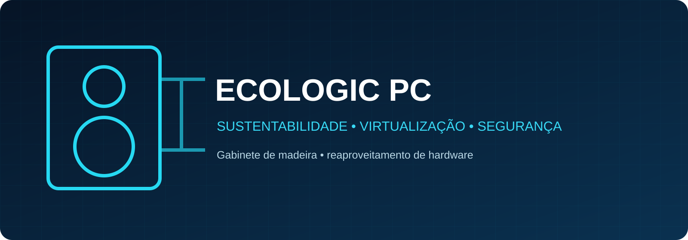
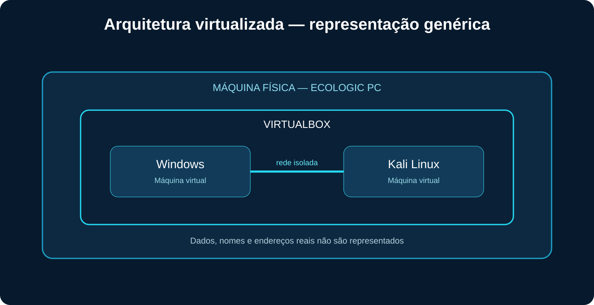

<p align="center"></p>

# Ecologic PC — Casemod com Virtualização e Segurança

Projeto acadêmico de casemod sustentável, com gabinete construído em madeira e decoração inspirada em plantas, que integrou reaproveitamento de hardware, virtualização, redes de computadores e segurança em ambiente controlado.

## Problema

O estudo de infraestrutura, sistemas operacionais e segurança exige um ambiente em que configurações e testes possam ser realizados sem afetar máquinas ou redes externas. Ao mesmo tempo, equipamentos e componentes ainda funcionais podem ser descartados antes do fim de sua vida útil.

## Objetivo

Construir um computador customizado com identidade ecológica e utilizá-lo como base para um laboratório virtualizado, unindo criatividade, reaproveitamento e experimentação técnica.

## Solução desenvolvida

O gabinete foi construído em madeira e recebeu decoração inspirada em plantas e natureza. O computador físico foi preparado com VirtualBox e ambientes Windows e Kali Linux, formando uma rede de testes controlada para exercícios de comunicação, configuração e observação.

## Sustentabilidade e ESG

O Ecologic PC incorporou sustentabilidade à concepção do casemod por meio do reaproveitamento de hardware e da escolha de uma estrutura customizada em madeira. A decoração com plantas reforçou visualmente a união entre tecnologia e consciência ambiental.

O projeto dialoga com conceitos de economia circular e com o pilar ambiental do ESG ao incentivar maior aproveitamento de equipamentos e reflexão sobre descarte eletrônico. Não são declaradas reduções quantitativas de resíduos ou emissões, pois esses impactos não foram medidos.

## Arquitetura virtualizada



O diagrama utiliza nomes e endereços fictícios. Ele explica o funcionamento conceitual sem reproduzir configurações potencialmente sensíveis.

## Atividades documentadas

- montagem e organização de um computador customizado;
- construção de gabinete em madeira;
- criação de identidade visual inspirada em plantas e natureza;
- reaproveitamento de hardware e extensão de sua utilização;
- criação e gerenciamento de máquinas virtuais;
- instalação e uso de Windows e Kali Linux;
- configuração de uma rede virtual de laboratório;
- verificação de conectividade entre ambientes;
- observação de serviços e fundamentos de segurança;
- administração básica de sistemas operacionais.

## Tecnologias

- VirtualBox
- Windows
- Kali Linux
- virtualização
- redes TCP/IP
- administração de sistemas
- segurança da informação
- sustentabilidade
- economia circular
- fundamentos de ESG

Python e SQL não são atribuídos ao projeto, pois não há confirmação de uso.

## Segurança

O repositório não contém credenciais, endereços reais, exploração de sistemas, dados de terceiros ou instruções ofensivas. Os exemplos são limitados a um laboratório autorizado e isolado.

## Organização

```text
├── assets/                         # capa e arquitetura visual
├── docs/
│   ├── ambiente-virtualizado.md
│   ├── laboratorio-seguranca.md
│   └── resultados-e-aprendizados.md
├── SECURITY.md
├── LICENSE
└── README.md
```

## Limitações

- os arquivos e registros originais de 2024 não estão disponíveis;
- versões, componentes físicos e parâmetros exatos não são declarados sem evidência;
- a arquitetura visual é uma reconstrução genérica;
- não são apresentados resultados quantitativos não medidos.

## Melhorias futuras

- recriar o laboratório em um simulador documentado;
- registrar configurações reproduzíveis e anonimizadas;
- incluir testes defensivos automatizados;
- comparar modos de rede do VirtualBox;
- monitorar recursos utilizados pelas máquinas virtuais.

## Competências desenvolvidas

Infraestrutura de TI, virtualização, redes, sistemas operacionais, documentação técnica, segurança da informação, sustentabilidade, criatividade e resolução de problemas.

## Autor

**Sandro Ferreira**

[LinkedIn](https://www.linkedin.com/in/sandrozdb/) · [GitHub](https://github.com/sandrozdb)

## Licença

Distribuído sob a licença MIT. Consulte [LICENSE](LICENSE).
